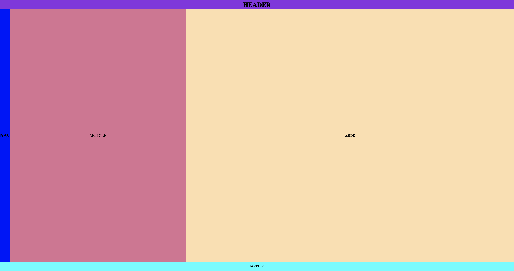

 # Flex 4

# Descrição
Página Flex 4 HTML com vinculo ao Github desenvolvido durante a disciplina de Linguagem de Marcação da escola SENAI de Jandira.

# Tecnologias
* HTML
* CSS
* Markdown
* Git
& Github

## Autor
[ANA CATARINA](www.linkedin.com/in/analourencofer013)

